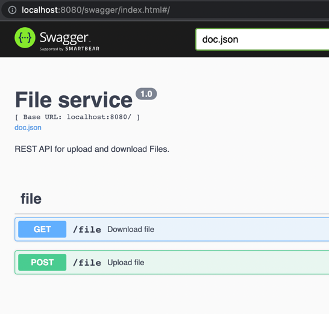

# File server

Сервис для хранения и загрузки файлов.

Загужаемые файлы делятся по 1 МБ. 
Если кусочек файла весит меньше 1 МБ, то он дописывается NULL байтами.
При скачивании файла,
сервис собирает все фрагменты в единый и отбрасывает NULL байты.

В данный момент сервис не может обрабатывать файлы с русским названием
или содержащие символ "_".

    Swagger для работы с сервисом
    localhost:8080/swagger/index.html

При скачивании больших файлов
рекомендуется использовать Postman.

### Пример

1) Загрузить файл:

    curl -X 'POST' \
    'http://localhost:8080/file' \
    -H 'accept: application/json' \
    -H 'Content-Type: multipart/form-data' \
    -F 'file=@pic-components.png;type=image/png'

2) Скачать файл:

    curl -X 'GET' \
    'http://localhost:8080/file?file_name=components.png' \
    -H 'accept: application/json'

P.S.
Все фрагменты файлов удаляются вручную и хранятся в папке "files_folder".